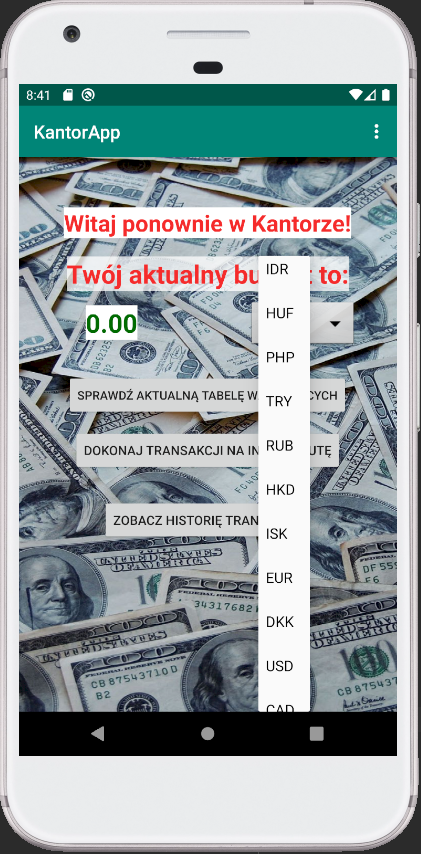
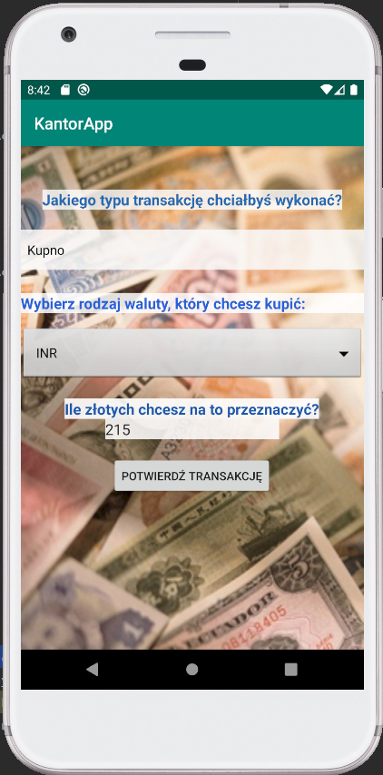
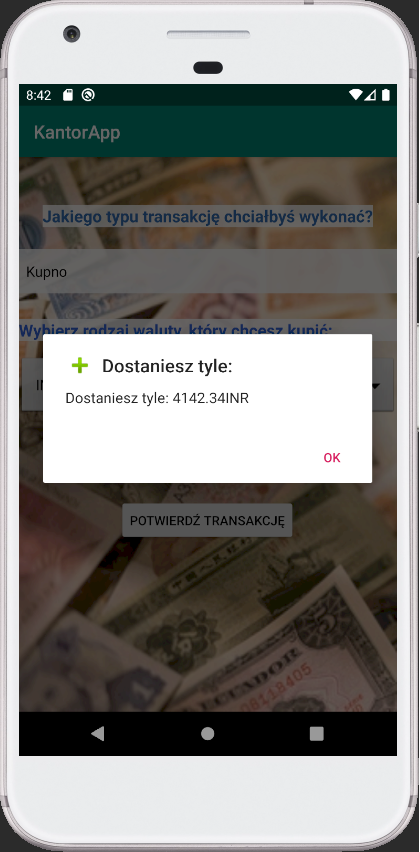

# KantorApp
> A simple application using the api of the National Bank of Poland enabling budget management through currency exchange.

## Table of contents
* [General info](#general-info)
* [Screenshots](#screenshots)
* [Technologies](#technologies)
* [Features](#features)
* [Status](#status)
* [Contact](#contact)

## General info
The KantorApp application is created for Android phones, which allows you to set a budget and then make transactions in any currency. You can also see tables of exchange rates and average exchange rates. 
The application downloads the latest data from the National Bank of Poland Web API. Each transaction completed can be seen in the transaction history.

## Screenshots

  

  

  

  
  
  

  

  

  

 

## Technologies
* Java - version 11
* NBP Web API

## Features
List of features ready:
* Ability to set and edit your budget
* Checking currency exchange tables and average exchange rates
* Buying or selling currencies affecting the set budget
* View transaction history

## Status
Project is: _finished_.

## Contact
Created by [Piotr Buczek](mailto:piotr.buczek37@gmail.com?subject=[GitHub]%20KantorApp) - feel free to contact me!
